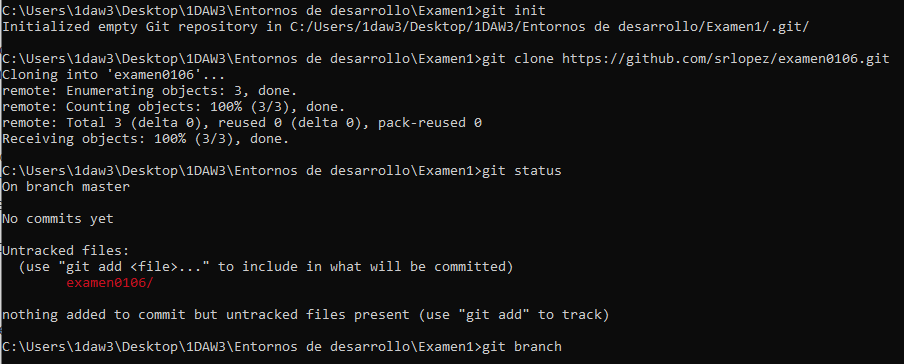
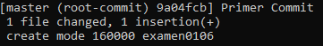
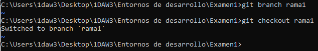
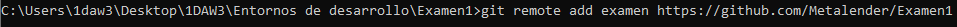
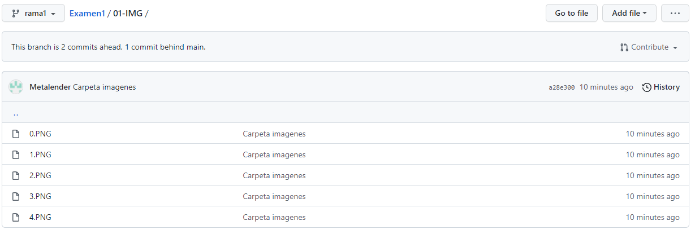

# Examen Entornos de desarrollo 2021/10/15 #

**Primer paso**
Crear una incidencia

**Segundo paso**
iniciar el repositorio local y clonar el repositorio remoto

**Tercer paso**
Realizar el primer commit

**Cuarto paso**
Crear una rama y moverse a ella

**Quinto paso**
Añadir el repositorio remoto al repositorio local

**Sexto paso**
Comprobar que se han aplicado los cambios
