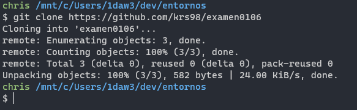
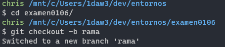
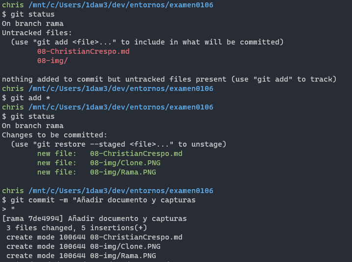
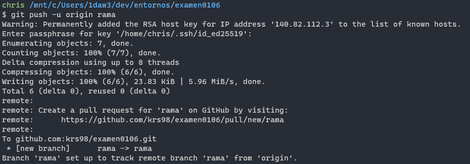
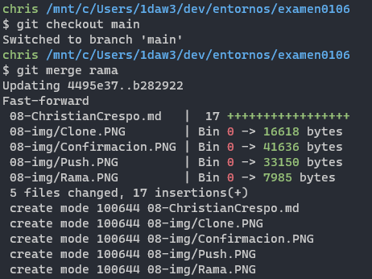
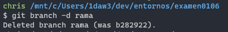

# Guión de Examen

1. Tras crear la incidencia y hacer el fork del repositorio, lo he **clonado** con `git clone`.  

1. La rama la he creado mediante `git checkout -b rama`  

1. He hecho un **commit** con solo estos cambios para documentar el proceso:  

1. Seguido del **push**:  

1. Y el resto de cambios se han realizado de forma similar.

1. Además, como algunas imagenes se mostraban al lado del texto en vez de debajo, he realizado un último commit moviendo las imágenes a la siguiente línea y añadiendo los dos espacios necesarios al final de la anterior.

1. Antes de borrar la rama, la he juntado a la principal mediante `git merge`:  

1. Y borrada con `git branch -d`:  

