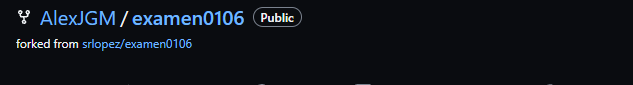
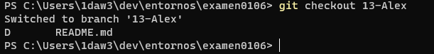
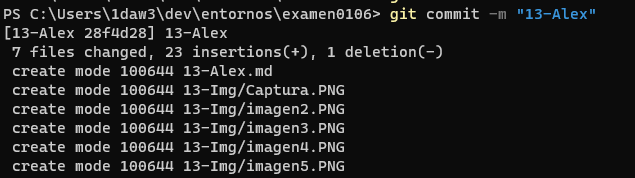

# examen0106

# **Pasos Git**

1. **Crear una incidencia**

      

2. **Hacer un fork**

      

3. **Luego lo clonaremos a local**

    

4. **Crear una rama de trabajo**   

      

5. **Cambiamos a la rama**

    

6. **Guardaremos los cambios hechos**

    
